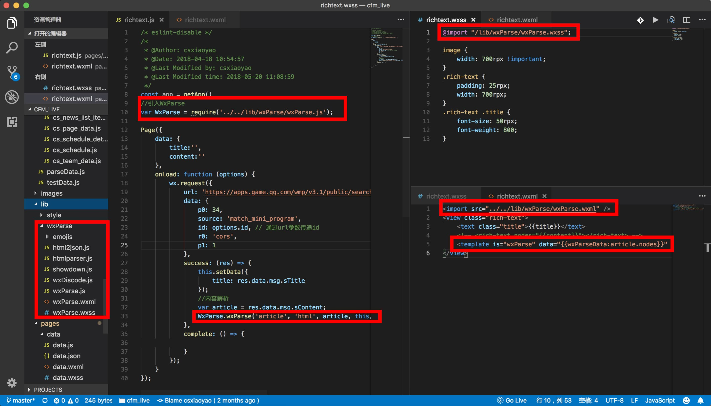
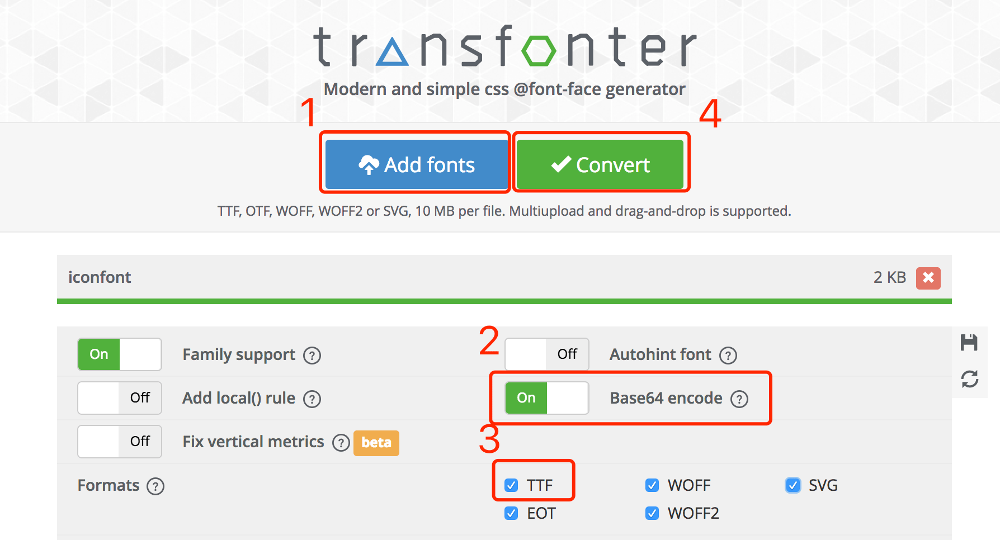
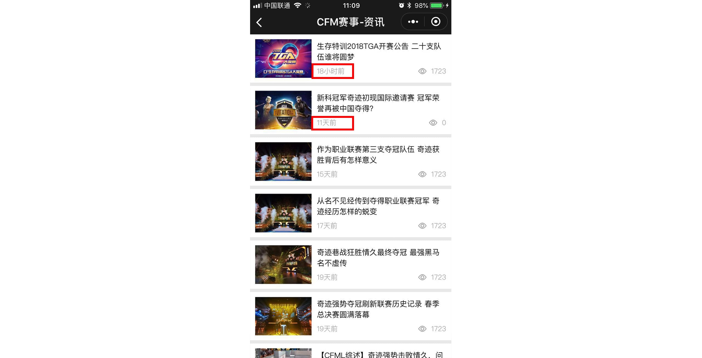

# 小程序开发总结 - 开发技巧和第三方插件的使用

## 1. 使用Promise处理异步接口

es6的Promise让异步接口的处理变得轻松，在旧版本的小程序中并不原生支持Promise，需要引入第三方库，例如：[https://github.com/stefanpenner/es6-promise](https://github.com/stefanpenner/es6-promise)，然而在新版的小程序中已经原生支持了Promise，直接使用即可。

```
// 从服务端获取用户登录信息，此处仅作演示，实际使用需要本地存储，避免频繁调用线上接口
const getUserInfo = () => {
    return new Promise((resolve, reject) => {
        wx.request({
            url: 'https://xxxxx/login',
            data: {},
            success: (res) => {
            	resolve(res);
            },
            fail: () => {
            	reject();
            }
        })
    })
}
```

同步处理后续命令

```
getUserInfo().then((res)=>{
	let userInfo = res;
});
```

## 2. 富文本的显示

小程序中经常需要展示资讯类信息，解析富文本有两种有效的方式：官方的rich-text富文本组件和wxParse组件。


### **rich-text**

rich-text富文本组件是小程序1.4.0版本后推出的，可以通过js脚本把html解析成一定格式的nodes，然后在 rich-text 中显示。详细教程见官方文档：[https://developers.weixin.qq.com/miniprogram/dev/component/rich-text.html](https://developers.weixin.qq.com/miniprogram/dev/component/rich-text.html)，但是这个组件存在一下一些问题：

1. 对图片的显示很不友好
2. 支持的node类型有限，例如不支持解析wxml
3. 需要手动解析html文本为node对象，成本较高

因此，更推荐第二种渲染富文本的方式——wxParse组件

###**wxParse组件（推荐）**

wxParse是专门用于微信小程序的富文本解析组件，它支持Html及markdown等转wxml可视化，github地址：[https://github.com/icindy/wxParse](https://github.com/icindy/wxParse)，github中已有详细的教程，此处简单总结下配置流程：



1. 复制wxParse库文件到项目目录

2. 项目中引入wxParse库文件，`wxParse.wxml`、`wxParse.js`、`wxParse.wxss`

3. 页面js文件中处理富文本`WxParse.wxParse(bindName, type, data, target, imagePadding)`，如此处为：WxParse.wxParse('article', 'html', res.data.msg.sContent, this, 5)

   > 参数说明：
   >
   > bindName：绑定的数据名(必填) 
   >
   > type：html或md(必填) 
   >
   > data：传入的具体数据(必填) 
   >
   > target：Page对象,一般为this(必填) 
   >
   > imagePadding：当图片自适应时的左右padding(默认为0,可选) 

4. 页面渲染

   ```
   <view><template is="wxParse" data="{{wxParseData:article.nodes}}" /></view>
   ```

## 3. 图标字体的使用

微信小程序开发，可以像web开发使用字体图标，但是只是支持Unicode字体

**1. 选择图标**

图标可以直接使用`fontawesome`、`ionicons`的字体库，但是由于小程序有2M的大小限制，此处强烈建议使用`iconfont`等平台自选图标打包得到ttf字体文件

**2. 图标格式转换 ttf => base64**

在[https://transfonter.org](https://transfonter.org)平台进行转换，转换完后进行下载



**3. 引入样式文件**

打开下载得到的包中的`stylesheet.css`文件，获得类似以下代码，存入新的wxss文件`iconfont.wxss`

```
@font-face {
    font-family: 'iconfont';
    src: url(data:font/truetype;charset=utf-8;base64,xxxxx==) format('truetype');
    font-weight: normal;
    font-style: normal;
}
```

**4. 使用字体图标**

```
@import "../../lib/style/font/iconfont.wxss";
.page:after {
    font-family: 'iconfont';
    content: '\e636';
}
```

>如果直接使用base64图片
>
>```
>.text:after{
>    content: url("data:image/png;base64,xxxxx");
>    position: absolute;
>    top: 0rpx;
>    left: 0rpx;
>}
>```


## 4. 使用WeUI，统一UI样式

WeUI 是一套同微信原生视觉体验一致的基础样式库，由微信官方设计团队为微信内网页和微信小程序量身设计，令用户的使用感知更加统一。包含`button`、`cell`、 `dialog`、 `progress`、 `toast`、 `article`、 `actionsheet`、 `icon` 等各式元素，github地址：[https://github.com/Tencent/weui-wxss](https://github.com/Tencent/weui-wxss)，内含详细使用教程，简单来说，样式文件中引入 `dist/style/weui.wxss` 即可


## 5. 接入腾讯视频插件

github地址：[https://github.com/tvfe/txv-miniprogram-plugin](https://github.com/tvfe/txv-miniprogram-plugin)

**1. 申请插件使用权限**

详见微信官方说明文档 https://developers.weixin.qq.com/miniprogram/dev/framework/plugin/using.html，申请完成后如下图：


**2. 引入插件代码**

在`app.json`中引入

```
{  
	"plugins": {
		"tencentvideo": {
			"version": "1.0.5",
			"provider": "wxa75efa648b60994b"
		}
	}
}
```

**3. 配置插件标签 txv-video**

在对应的page的配置json中配置

```
{
	"usingComponents": {
		"txv-video": "plugin://tencentvideo/video"
	}
}
```

**4. page中使用**

require插件

```
const txvContext = requirePlugin("tencentvideo");
```

获取vid

```
Page({
    data: {
        vid: ''
    },
    onLoad(options){
    	...
        // 获取视频vid
        wx.request({
            url: 'https://apps.game.qq.com/XXX',
            data: data,
            success: (res) => {
            	this.setData({
                    vid: res.sVID
            	});
            }
        });
    }
});
```

渲染，**注意使用 wx:if 控制渲染，避免出现渲染空vid出错**

```
<txv-video 
    wx:if="vid.length>0"
    vid="{{vid}}"
    playerid="txv1" 
    autoplay="{{true}}" 
 ></txv-video>
```


## 6. 使用 moment.js 处理日期 & 汉化



中文文档：[http://momentjs.cn/docs/](http://momentjs.cn/docs/)

H5使用moment.js可以方便的处理日期，小程序中同样可以使用moment.js

首先在utils文件夹中复制moment.js库文件


为了更好的支持中文的显示，需要对原始的文件进行改造，在`return _moment;`前加入中文字典

```
_moment.defineLocale('zh-cn', {    
    months : '一月_二月_三月_四月_五月_六月_七月_八月_九月_十月_十一月_十二月'.split('_'),    
    monthsShort : '1月_2月_3月_4月_5月_6月_7月_8月_9月_10月_11月_12月'.split('_'),    
    weekdays : '星期日_星期一_星期二_星期三_星期四_星期五_星期六'.split('_'),    
    weekdaysShort : '周日_周一_周二_周三_周四_周五_周六'.split('_'),    
    weekdaysMin : '日_一_二_三_四_五_六'.split('_'),    
    longDateFormat : {    
        LT : 'Ah点mm分',    
        LTS : 'Ah点m分s秒',    
        L : 'YYYY-MM-DD',    
        LL : 'YYYY年MMMD日',    
        LLL : 'YYYY年MMMD日Ah点mm分',    
        LLLL : 'YYYY年MMMD日ddddAh点mm分',    
        l : 'YYYY-MM-DD',    
        ll : 'YYYY年MMMD日',    
        lll : 'YYYY年MMMD日Ah点mm分',    
        llll : 'YYYY年MMMD日ddddAh点mm分'    
    },    
    meridiemParse: /凌晨|早上|上午|中午|下午|晚上/,    
    meridiemHour: function (hour, meridiem) {    
        if (hour === 12) {    
            hour = 0;    
        }    
        if (meridiem === '凌晨' || meridiem === '早上' ||    
                meridiem === '上午') {    
            return hour;    
        } else if (meridiem === '下午' || meridiem === '晚上') {    
            return hour + 12;    
        } else {    
            // '中午'    
            return hour >= 11 ? hour : hour + 12;    
        }    
    },    
    meridiem : function (hour, minute, isLower) {    
        var hm = hour * 100 + minute;    
        if (hm < 600) {    
            return '凌晨';    
        } else if (hm < 900) {    
            return '早上';    
        } else if (hm < 1130) {    
            return '上午';    
        } else if (hm < 1230) {    
            return '中午';    
        } else if (hm < 1800) {    
            return '下午';    
        } else {    
            return '晚上';    
        }    
    },    
    calendar : {    
        sameDay : function () {    
            return this.minutes() === 0 ? '[今天]Ah[点整]' : '[今天]LT';    
        },    
        nextDay : function () {    
            return this.minutes() === 0 ? '[明天]Ah[点整]' : '[明天]LT';    
        },    
        lastDay : function () {    
            return this.minutes() === 0 ? '[昨天]Ah[点整]' : '[昨天]LT';    
        },    
        nextWeek : function () {    
            var startOfWeek, prefix;    
            startOfWeek = moment().startOf('week');    
            prefix = this.unix() - startOfWeek.unix() >= 7 * 24 * 3600 ? '[下]' : '[本]';    
            return this.minutes() === 0 ? prefix + 'dddAh点整' : prefix + 'dddAh点mm';    
        },    
        lastWeek : function () {    
            var startOfWeek, prefix;    
            startOfWeek = moment().startOf('week');    
            prefix = this.unix() < startOfWeek.unix()  ? '[上]' : '[本]';    
            return this.minutes() === 0 ? prefix + 'dddAh点整' : prefix + 'dddAh点mm';    
        },    
        sameElse : 'LL'    
    },    
    ordinalParse: /\d{1,2}(日|月|周)/,    
    ordinal : function (number, period) {    
        switch (period) {    
        case 'd':    
        case 'D':    
        case 'DDD':    
            return number + '日';    
        case 'M':    
            return number + '月';    
        case 'w':    
        case 'W':    
            return number + '周';    
        default:    
            return number;    
        }    
    },    
    relativeTime : {    
        future : '%s内',    
        past : '%s前',    
        s : '几秒',    
        m : '1分钟',    
        mm : '%d分钟',    
        h : '1小时',    
        hh : '%d小时',    
        d : '1天',    
        dd : '%d天',    
        M : '1个月',    
        MM : '%d个月',    
        y : '1年',    
        yy : '%d年'    
    },    
    week : {    
        dow : 1, // Monday is the first day of the week.    
        doy : 4  // The week that contains Jan 4th is the first week of the year.    
    }    
});
```

完成汉化后即可在页面中使用

```
// 引入moment.js
const moment = require('../../utils/moment.js');

// 使用，更多用法见文档
let startTime = xxxxx
const time = moment.unix(startTime).format('MMMDo HH:mm');
```