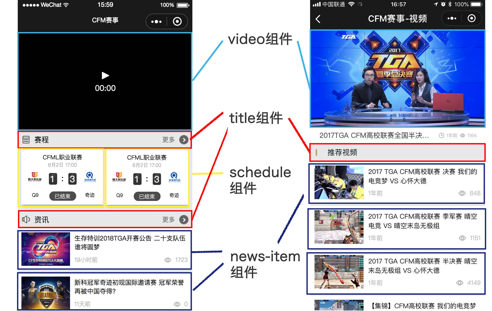
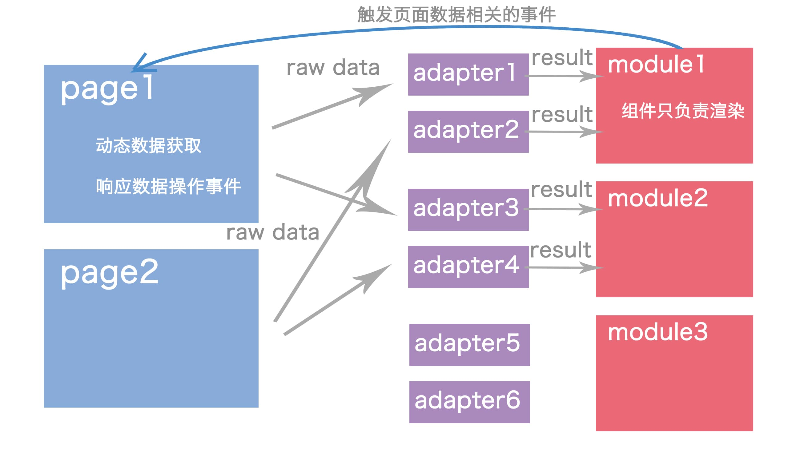

# 小程序开发总结 - 模块化开发流程规范

## 1. 小程序与H5的开发成本对比

小程序的开发和传统的H5相比简单许多，主要体现在：

**1. 环境成本低：**

H5 的开发涉及开发工具、前端框架、模块管理工具、任务管理工具、UI库、接口调用工具、各种浏览器运行环境等，尽管H5丰富的开发环境给了开发者更加灵活的配置方案，但增加了环境配置的成本，而开发微信小程序**，**由于微信团队提供了开发者工具，并且规范了开发标准，前端常见的HTML、CSS变成了微信自定义的WXML、WXSS，WXML，官方文档中都有明确的使用介绍，开发者无需关心各种环境的配置，专注于开发业务逻辑即可。

**2. 拥有强大丰富的api，无视浏览器兼容性问题：**

H5开发者深有体会，在编写代码时经常遇到兼容性问题，尤其是调用硬件部分，各个浏览器的支持程度差别很大。然而开发微信小程序，无需考虑兼容性问题，直接按照官方文档提供的api进行调用即可。需要后端接口时调用request接口；需要上传下载时调用上传下载API；需要数据缓存时调用本地存储API；需要支持地图、罗盘、支付、扫码等功能都有对应的api；UI库直接使用官方的weui库即可。

**3. 布局适配更加容易**

开发H5时，完成响应式前端的成本较高，然而小程序只需考虑移动端布局即可，而且官方首推使用flex布局，使得前端布局轻而易举。此外，小程序提供了新的计算单位`rpx`，整个页面宽度被固定为750rpx，开发者对于界面的布局真正做到了随心所欲。

## 2. 模块化优势1 — 组件复用

和前端框架vue相似，新版本的小程序已经支持了模块化开发，所谓的模块化开发指的是将复杂的页面拆分为各个组件单独进行开发，模块化的开发模式使得代码逻辑清晰，代码充分复用，减少了开发成本。



上图是CFM赛事直播小程序的两张截图，左边的是主页，右边的是视频详情页，这两个页面的相似度极高，可以看到主页整个页面仅由4个组件组合而成，下面是主页的全部wxml代码：

```
<view class="container">
	<video src="{{liveSrc}}"></video>
	<cs-title title="赛程" icon-pic="1-1.png" tab-url="/pages/data_detail/data_detail"></cs-title>
	<swiper autoplay="true" display-multiple-items="2">
		<swiper-item block wx:for="{{scheduleData}}" wx:key="index">
			<cs-schedule schedule-data="{{item}}" bind:component_order="order" bind:component_cancel="cancel"></cs-schedule>
		</swiper-item>
	</swiper>
	<cs-title title="资讯" icon-pic="1-4.png" page-url="/pages/news/news"></cs-title>
	<block wx:for="{{newsData}}" wx:key="index">
		<cs-news-item news-data="{{item}}" new-page="{{true}}"></cs-news-item>
	</block>
</view>
```

上面的代码如果简化下，去掉属性参数，即为：

```
<view>
	<video></video>
	<cs-title></cs-title>
	<swiper>
		<cs-schedule></cs-schedule>
	</swiper>
	<cs-title></cs-title>
	<cs-news-item></cs-news-item>
</view>
```

而右边的视频详情页也可以通过堆砌组件完成页面搭建

```
<view>
	<video></video>
	<cs-tip></cs-tip>
	<cs-title></cs-title>
	<cs-news-item></cs-news-item>
</view>
```

其中的组件单独进行开发即可，一次开发，多次使用

## 3. 模块化优势2 — 代码逻辑清晰、便于维护

模块化的另一大优势，代码逻辑结构、便于维护，将大段的代码分拆成多个组件，每个组件内只存放组件本身的代码，使得整体代码逻辑清晰，便于维护。

## 4. 模块化开发规范 — 文件组织


如图所示，所有的组件需要存放在components文件夹下，为了区分组件，可以使用文件夹进行组件分类：

1. common：存放的是项目中常用的组件，如用户头像组件、日历组件、选项卡组件
2. form：顾名思义，存放的是form表单相关的通用组件，如圆形按钮、table、tip组件
3. [other]：对于一些较为特殊的业务相关的组件，存放在对应的目录下，比如在match赛事文件夹下存放了赛程表、积分榜等组件

对于三类组件的使用频率和灵活性不尽相同：

1. common类组件和form表单类组件是项目中频繁使用的组件，对于这类组件，开发者需要花费更多的精力打磨细节，设置更多参数，以适应不同的场景
2. 纯粹的业务相关的组件由于功能特殊，往往不会复用，之所以分离作为组件，一般是因为业务逻辑复杂，单独作为组件有利于简化父页面的代码逻辑，这类组件只需要满足需求即可。

## 5. 模块化开发规范 — 命名规则

良好的命名是对组件最好的注释，组件代码中变量函数的命名不必多说，对于自定义组件名称，统一以 `cs` 开头，区别于系统组件；为了统一组件名与wxml中的组件引用名，所有组件全部用小写字母命名，以下划线`_`隔词。

## 6. 模块化开发规范 — 自定义组件的配置与使用

官方文档见：[https://developers.weixin.qq.com/miniprogram/dev/framework/custom-component/](https://developers.weixin.qq.com/miniprogram/dev/framework/custom-component/)

此处简单总结配置与使用方法

**组件的配置** cs_xxx.json

```
{
	"component": true,
	"usingComponents": {
		"cs-tip": "path/to/the/custom/component"
	}
}
```

**页面中引用组件的配置**

```
{
	"usingComponents": {
		"cs-title": "/components/common/cs_title/cs_title"
	}
}
```

**组件的引用**

```
<view>
	<cs-title></cs-title>
</view>
```

## 7. 模块化开发规范 — 减少组件耦合



模块化开发为了更好的实现组件复用，应该尽量减少组件间的耦合，需要遵循以下原则：

1. 组件只负责前端样式的渲染，只通过参数接收数据，不主动涉及原始数据的处理；
2. 适配器只负责数据的处理，输入原始数据，输出组件适用的数据；
3. page页面中从服务端拉取数据，经过adapter处理，由组件负责渲染；
4. 组件中涉及修改服务端数据的事件，全部交由page页面处理，触发page中对应的事件

### 组件通信 - 页面向组件传参

页面引用自定义组件，参数直接作为属性传递，下面引用的是一个名为"cs-xiaoyao"的组件，注意参数命名方式

```
<cs-xiaoyao schedule-data="{{item}}" new-page="{{true}}"></cs-xiaoyao>
```

组件中获取参数，并监控参数变化重新渲染

```
Component({
    properties: {
        scheduleData: { // 属性名
            type: Object,
            observer: '_propertyChange' // 监控属性变化，为字符串
        }
        newPage: Boolean
    },
    data:{
        scheduleData:{},
        newPage: true
    },
    ready() {
        this.setData({
            scheduleData: this.properties.scheduleData,
            newPage: this.properties.newPage
        });
    },
    methods: {
        _propertyChange (newVal, oldVal) {
            ...
        }
    }
})
```

### 组件通信 - 组件调用父页面方法

组件只负责数据的渲染显示，组件中涉及修改服务端数据的事件，全部交由page页面处理，触发page中对应的事件

```
<button bindtap="formSubmit" formType="submit">提交</button>
```

组件中的事件处理

```
formSubmit(event) {
	// 事件选项
    const eventOption = {
    	composed: true
    }
    var eventDetail = {
        data: ...,
    }
    // 调用父页面的cancel事件
    this.triggerEvent('component_cancel', eventDetail, eventOption);
}
```

父页面调用组件，绑定事件

```
<cs-xiaoyao bind:component_cancel="cancel"></cs-xiaoyao>
```

父页面中的对应事件处理

```
cancel(event) {
    const data = eventDetail.detail.data;
    ...
}
```

